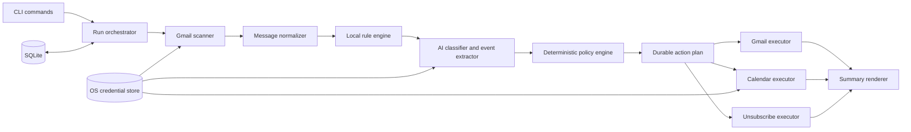

# Architecture

This document describes the system architecture defined in `CLAUDE.md` (the
source-of-truth design contract for this repository) and how it maps onto
the actual `src/` layout. If the two ever disagree, `CLAUDE.md` wins —
update this file to match it, not the other way around.

## What this is

`gmail` is a local, installable terminal application (npm package
`gmail-agent-cli`, binary `gmail`). It is not a web app, desktop GUI,
browser extension, hosted inbox service, or general-purpose email client.
It runs only when invoked, does not run as a background service, and
requires no server component.

## Pipeline, not an agent loop

The system is a fixed pipeline with a deterministic policy gate, not an
autonomous tool-calling loop. The AI classifier is one untrusted analysis
component: it receives no SDK client, credentials, function tools, shell,
network access, or prior conversation state, and it cannot directly
mutate Gmail or Calendar. It returns a typed assessment; a separate,
deterministic policy engine decides what — if anything — happens next.

```text
snapshot -> normalize -> explicit rules -> classify unresolved mail
         -> deterministic policy -> persist plan -> validate preconditions
         -> execute idempotently -> summarize
```



## Dependency direction

Dependencies point inward, toward `core/`. Vendor SDK adapters
(`gmail/`, `calendar/`, `ai/`, `auth/google-oauth.ts`) depend on the core
interfaces; `core/policy.ts` never imports Google SDK response types,
SQLite row shapes, or OpenAI response types. The abstraction boundary is
expressed as a small set of interfaces so a vendor could be swapped
without touching policy logic:

| Interface | Purpose | Location |
| --- | --- | --- |
| `Classifier` | One untrusted AI assessment per message | `src/ai/classifier.ts` |
| `CredentialStore` | OS-backed secret storage (Keychain / Credential Manager / Secret Service) | `src/auth/credential-store.ts` |
| `Clock` | Injected time source for deterministic, testable retry/DST behavior | `src/core/clock.ts` |

Gmail and Calendar access is not yet behind a formal `MailGateway`/
`CalendarGateway` interface in the current code — `src/gmail/*` and
`src/calendar/*` are called directly from commands and the orchestrator —
but they are isolated to those directories, and no `googleapis` types leak
into `src/core/*`.

## Module map

```text
src/
  cli.ts                 Commander entrypoint; `gmail` with no args == `gmail work`
  commands/               One file per CLI command; thin glue over core/gmail/calendar
    work.ts               `gmail work` — the default pipeline, dry-run or real
    spam.ts / important.ts  Rule creation + immediate application
    rules.ts, summary.ts, undo.ts, auth.ts, config.ts, doctor.ts
    shared.ts             Resolves the signed-in account + authenticated API clients
  core/
    models.ts             Domain types: NormalizedMessage, EmailAssessment, PlannedAction, RuleGroup, ...
    policy.ts             The deterministic action policy (see below) — pure, no I/O
    action-plan.ts         Turns policy decisions into durably-keyed PlannedAction rows
    orchestrator.ts        Wires scan -> normalize -> rules -> classify -> policy for `gmail work`
    ids.ts                 Deterministic action keys / Calendar event IDs / content hashes
    clock.ts, errors.ts, lock.ts, bootstrap.ts
  gmail/
    client.ts              Authenticated googleapis Gmail client factory
    scanner.ts              messages.list / messages.get / users.history.list wrappers
    normalize.ts            HTML->bounded plain text, header parsing, content hashing
    labels.ts                Gmail system label constants + protection-signal helpers
    executor.ts              trash / untrash / grouped batchModify mutations
  ai/
    classifier.ts            The `Classifier` interface
    not-configured-classifier.ts  Always-unavailable stub (see "AI status" below)
    schema.ts                 Zod Structured-Outputs schema for the (not yet wired) real classifier
  calendar/
    client.ts                 Authenticated googleapis Calendar client factory
    event-policy.ts            Real-code validation of AI-extracted event candidates (dates, duration, timezone)
    idempotency.ts              Deterministic event IDs, provenance, insert-with-409-reconciliation
  unsubscribe/
    headers.ts                 List-Unsubscribe / mailto: parsing and validation
    safe-http.ts                 SSRF-hardened HTTPS client for the RFC 8058 one-click POST
  rules/
    matcher.ts                  Evaluates one matcher / one rule group against a message
    resolver.ts                  Groups messages into subscription identities; conflict detection
    auth-signals.ts               Authentication-Results parsing for DKIM/DMARC-bound matchers
  state/
    database.ts                  SQLite open + pragma + migration runner
    migrations/                   Ordered, append-only schema migrations
    repositories/                  Typed CRUD over accounts / rule_groups / runs / actions
  auth/
    google-oauth.ts                Installed-app PKCE flow, loopback listener
    credential-store.ts             OS credential store interface + keytar-backed implementation
  summary/
    build-summary.ts                 Deterministic aggregation of one run's outcomes
    render-human.ts, render-json.ts   The two `--json` / human output modes
  config/
    schema.ts, paths.ts, load.ts       Non-secret config validated with Zod; OS-appropriate paths
  logging/
    logger.ts                          pino with redaction; progress goes to stderr
```

## The deterministic action policy

`src/core/policy.ts` (`evaluateMessagePolicy`) is the single place that
decides what happens to a message, applied in this precedence order:

1. An explicit local **spam** rule match plans Trash and nothing else —
   unless the message is protected (see below), which always wins.
2. Unprotected native Gmail Spam plans Trash without any AI call.
3. An authenticated high-risk signal (security/financial/etc.) gates the
   promotion/automated-low-value Trash path behind a real, usable
   assessment — a bulk-mail label alone can never trigger Trash for a
   vetoed message.
4. A high-confidence AI `promotion` / `automated_low_value` result plans
   Trash. `suspicious` / `unknown` / an unavailable assessment produce
   **no** AI-derived mutation at all (no trash, no star, no event) — only
   Review eligibility.
5. A qualifying importance score/confidence, or an explicit **important**
   rule, adds `STARRED` + `IMPORTANT`.
6. A qualifying, validated event candidate creates a Calendar event.
6a. A non-null `category` from the assessment proposes a topical **label**
    action — gated on a *separate*, run-wide batch-size check applied in
    `core/orchestrator.ts` after all messages are classified (see
    "Automatic topical labeling" below), not in `policy.ts` itself, since
    that decision needs to see every other message in the run.
6b. A message that actually gets a validated Calendar event also gets a
    deterministic "Calendar" label action and an archive action,
    regardless of read state — added in `orchestrator.ts`'s
    `finalizeOutcome`, right alongside the `calendar_create` prediction,
    the same way `calendar_create` itself is "predicted at policy time,
    executed later in `work.ts`."

By product decision, every confidence threshold in
`DEFAULT_POLICY_THRESHOLDS` (`src/core/policy.ts`) is currently a uniform
**0.90** — lower than the design doc's original launch-precision defaults
(0.97/0.98/0.85/0.90/0.95). This trades some precision for more automation,
accepted specifically because every action is durably logged and fully
enumerable via `gmail summary <run-id>` (no truncation) and reversible via
`gmail undo` (except unsubscribe, which cannot be reversed by design).
7. Every remaining message that is read and still in the Inbox gets
   archived — even if it was starred or used to create an event. Trash is
   the only outcome mutually exclusive with everything else.

"Protected" means: a user-created important rule matches, or the message
carries a `STARRED`/`IMPORTANT` label this app's own ledger cannot
attribute to itself. Protected messages are never auto-trashed. This is
enforced in `policy.ts` and covered by unit tests in
`tests/unit/policy.test.ts` (e.g. "never trashes a protected message even
with an explicit spam rule").

**Fixed bug (protection was blocking event/label extraction, not just
trash/star):** `evaluateMessagePolicy` used to gate its *entire*
AI-derived block — trash, star, Calendar event, and label — behind a
single `!isProtected` check, even though `CLAUDE.md` is explicit that
protection ("an important rule... can bypass importance classification
but not event extraction") should only suppress trash and the redundant
AI-derived star. Since Gmail's own ML frequently marks transactional and
appointment mail `IMPORTANT` on its own — exactly the mail most likely to
contain a real calendar event — this silently dropped calendar-event (and
topical-label) creation for a large, non-obvious slice of messages,
independent of confidence or any other setting. Trash-eligibility and the
AI-derived star/important addition are now gated behind `!isProtected`
individually inside the assessment block, while event extraction and
topical labeling are evaluated unconditionally whenever a usable
assessment exists — matching the precedence list above and the explicit
spec language. `POLICY_VERSION` was bumped (`policy-v4`) to invalidate
any assessment cached under the old behavior.

## Data model (SQLite, `src/state/migrations/001_initial_schema.ts`)

One database per OS user, WAL mode, foreign keys on, `0600` permissions
enforced at open time (`src/state/database.ts` refuses to proceed if the
file is group/world-readable on POSIX platforms).

| Table | Purpose |
| --- | --- |
| `accounts` | Account hash, display email, timezone, Gmail history marker, setup/automation flags |
| `messages` | Per-message classifier/policy version projection (no bodies, no verbatim evidence) |
| `rule_groups` / `rule_matchers` | User-created spam/important categories and their concrete matchers |
| `runs` | One row per `gmail work`/`spam`/`important` invocation |
| `actions` | The durable action ledger — outbox pattern: `planned -> applying -> applied \| failed_* \| skipped_conflict \| unknown_no_retry` |
| `unsubscribe_attempts` | Per-subscription-identity attempt history (never retried automatically) |
| `calendar_links` | Account/message/candidate -> Calendar event ID + provenance |
| `settings` | Non-secret versioned settings only |

Secrets (OAuth refresh tokens, AI API keys) never enter this database —
they live only in the OS credential store, addressed via
`CREDENTIAL_KEYS` in `src/auth/credential-store.ts`.

## AI status in this build

The real OpenAI-backed classifier is implemented:
`src/ai/openai-classifier.ts`'s `OpenAiClassifier` makes one stateless
call to OpenAI's Responses API per unresolved message (`store: false`, no
tools, no `previous_response_id`). By product decision, the model fills
in a deliberately minimal, cheap wire schema (`src/ai/schema.ts`'s
`EmailFlagsSchema`) — plain booleans (`spam`, `suspicious`, `important`,
`hasEvent`) plus a few event fields and one short nullable string
(`category`), no confidence floats, no free-text summary, no reason-code
array — parsed via `zodTextFormat`. It never
receives Gmail/Calendar credentials or the ability to call anything — it
returns flags, and `openai-classifier.ts` deterministically maps them
onto the richer internal `EmailAssessment` shape `core/policy.ts` already
knows how to consume (fixed confidence values that clearly clear or miss
its 0.90 thresholds; the flags *are* the decision, the policy engine's
threshold check is satisfied by construction). The `summary` field is no
longer AI-generated at all — `buildDeterministicSummary` in
`src/ai/prompt.ts` derives it from the subject and first non-blank line
of content, at zero token cost.

`src/ai/prompt.ts` holds `buildDeveloperInstructions(existingLabels)` —
the prompt-injection-hardened developer instructions (kept short — it's
sent on every call) plus, when the account has any custom Gmail labels, a
fixed suffix listing them so the model prefers reusing one over inventing
a near-duplicate; identical for every call within one run, so it's still
a fixed-prefix cost, not something that scales with mailbox size. It also
holds the untrusted user/input builder (excludes raw `List-Unsubscribe`/
`Authentication-Results` header values, only derived booleans; now
receives the message's real body when Gmail has one — see "Full message
body now fetched" below), and `FEW_SHOT_EXAMPLES` — a few labeled
input/output pairs sent as real prior turns before the actual message,
for the accuracy one-shot/few-shot prompting buys.

`normalizeCategoryLabel` (also in `prompt.ts`) trims/bounds the model's
free-text `category` guess before it's ever used as a real Gmail label
name; `openai-classifier.ts`'s `mapFlagsToAssessment` additionally forces
`category` to `null` whenever `suspicious` is true, regardless of what
the model returned for `category` — a phishing/scam message must never
be quietly filed under a friendly label.

Gmail-read concurrency and classifier-call concurrency are separate:
`OrchestratorDeps.concurrency` takes `{ gmailReads, aiCalls }`, and
`runWorkScan` (`core/orchestrator.ts`) processes messages in three
phases — fetch+normalize+rule-match (batched at `gmailReads`), then
classify only the non-bypassed subset (bounded at `aiCalls` via
`core/concurrency.ts`'s `mapWithConcurrency`, independent of the fetch
batch size), then pure policy evaluation. Gmail and an AI provider are
unrelated rate-limit domains, so sizing one off the other's batch size
was a bug; `work.ts` reads `aiCalls` from config (default 5 — raised
from an initial 2 once `OpenAiClassifier` itself gained retry/backoff,
so the higher concurrency doesn't cost accuracy under rate-limit
pressure). Immediately after phase 1, `preprocessed` is sorted
most-recent-first by `internalDate` before classification begins, so
both processing order and every downstream summary/output list newest
mail first regardless of the order Gmail's `messages.list` happened to
return it in.

`OpenAiClassifier.assess` (`src/ai/openai-classifier.ts`) wraps its
`responses.parse` call in `withApiRetry` (`src/core/api-retry.ts` —
renamed from `google-api-retry.ts` once it started being shared by both
the Google and OpenAI SDKs, both of which expose `.status`/
`.response.headers.get()` in a compatible shape) with a smaller retry
budget than the Gmail/Calendar default (3 attempts, 500ms/8s backoff
vs. Google's 5 attempts/1s/30s) — this call runs once per message, so a
worst-case full backoff cycle here is directly felt as "the whole run
is slow," unlike a single Gmail list-page retry.

`src/ai/resolve-classifier.ts` decides which classifier a run actually
uses: if a usable API key is found (the OS credential store first, under
`CREDENTIAL_KEYS.aiApiKey(accountHash)`, then the `OPENAI_API_KEY`
environment variable — the same one the OpenAI SDK itself defaults to),
`work.ts` uses `OpenAiClassifier`; otherwise it falls back to
`src/ai/not-configured-classifier.ts`, which always returns
`{ ok: false, unavailable: { reason: "not_configured" } }`. `policy.ts`
treats that identically to a refusal or schema failure — no AI-derived
mutation, the message is flagged for Review, and deterministic
read-archiving still proceeds. Presence of a usable key is currently both
necessary and sufficient to opt in; `config.aiEnabled` is not consulted
(there's no exposed command to toggle it yet, so gating on it would just
add a confusing extra step with no way to satisfy it).

`src/ai/random-classifier.ts` — a uniformly random (but correctly-shaped)
`Classifier`, used earlier in this project to exercise the full pipeline
without any API key — still exists but is no longer wired into `work.ts`.
It remains useful for testing the trash/star/archive/Calendar-creation
paths without spending API calls; **never point it at a real mailbox**.

### Full message body now fetched

`core/orchestrator.ts`'s `fetchAndNormalize` calls `fetchMessageFull`
(`format=full`) instead of `fetchMessageMetadata` (`format=metadata`) for
every message, bypassed or not — Gmail's `messages.get` costs the same 5
quota units regardless of `format`, so this is strictly more information
(the real body, via `extractBodyParts`) at no extra request-count or
quota cost, only larger response payloads for messages that turn out to
be bypassed. This is what actually lets event/calendar detection see real
message content instead of only Gmail's short snippet.
`fetchMessageMetadata` itself is unchanged and still exported from
`gmail/scanner.ts`, just no longer called from the orchestrator.

### Automatic topical labeling

`core/policy.ts` pushes a `label` `PolicyActionIntent` (`{ reasonCode:
"ai_category:<name>", labelName }`) whenever a non-suspicious assessment
carries a non-null `category`, gated by the same `!isUnresolvedKind`
check as star/important/event — so it's never proposed for a
trash-eligible or suspicious/unknown message. This is only a *candidate*:
`core/orchestrator.ts`'s `applyLabelBatchThreshold`, run once after every
message in the scan has been classified, groups these by
case-insensitive `labelName`, normalizes each surviving group to one
exact display name (first-seen casing), and drops any label action whose
group has fewer than `MIN_LABEL_BATCH_SIZE` (10) messages — a lone AI
guess never reaches Gmail. A message that gets a validated Calendar event
separately, unconditionally gets a `calendar_label:Calendar` label action
and an `archive` action added directly in `finalizeOutcome` (not subject
to the batch-size check, since it's a deterministic 1:1 consequence of a
real event, not a guess).

`gmail/custom-labels.ts` is the only place that talks to Gmail's label
API: `listUserLabels` (filtered to `type: "user"`, read-only, safe in
`--dry-run`) and `getOrCreateLabelId`, which matches case-insensitively
against a caller-supplied `Map` before ever calling `labels.create`, and
falls back to re-listing on an HTTP 409 (a name created concurrently,
e.g. by the user in the Gmail UI mid-run) rather than failing. `work.ts`
only calls `getOrCreateLabelId` — i.e. only actually creates a label —
inside its `!options.dryRun` branch, after threshold filtering has
already happened; a name that fails to resolve (a transient Gmail error)
is simply left out of that run's mutations rather than failing the whole
run. `gmail/executor.ts`'s `labelOnlyMutation(labelId)` and `work.ts`'s
extended `mutationForActions` fold label additions into the same
`applyGroupedLabelMutations` batch as star/important/archive, so a
message needing several of these gets one combined `batchModify` call,
not several.

### Pluggable provider

`config/schema.ts` models `aiProvider` (`"openai"` or
`"openai-compatible"`) and `aiBaseUrl`. `resolve-classifier.ts` reads
both: with `aiProvider: "openai-compatible"` and `aiBaseUrl` set,
`OpenAiClassifier` is constructed with that `baseURL` instead of
OpenAI's endpoint, so a self-hosted or alternate provider implementing
the same Responses API + Structured Outputs shape works without an
OpenAI-specific key or any code change.

## Command surface

By product decision, the CLI currently exposes only two commands, to keep
the MVP surface small:

- **`gmail`** (with `--dry-run` / `--json` / `--limit <n>`) — the whole
  product: scans, classifies, decides, and acts, exactly as `CLAUDE.md`
  describes for `gmail work`. Also performs sign-in inline the first time
  it's run — there is no separate `gmail auth login` command in this
  build. `--limit` caps the Inbox and native-Spam scans to the N most
  recent messages *each*, applied before any per-message `messages.get`
  call (via `listAllMessageIds`'s `safetyCapCount`, in
  `src/gmail/scanner.ts`) — that's what actually bounds Gmail API quota
  usage, not just how many list pages get fetched.
- **`gmail add <spam|important> <category...>`** — a single unified entry
  point over what `CLAUDE.md` specifies as two separate commands
  (`gmail spam` / `gmail important`); it dispatches to the same
  underlying logic in `src/commands/spam.ts` / `src/commands/important.ts`.
  Accepts one or more category arguments (Commander's `[categories...]`
  variadic syntax) — `runAdd` (`src/commands/add.ts`) loops over them,
  running each as its own fully independent `runSpam`/`runImportant`
  call; one category's failure (no matches, a conflict, etc.) doesn't
  stop the rest, and the command's exit code reflects the worst
  individual result.
- **`gmail category <names...>`** (`src/commands/category.ts`) — creates
  (or reuses, case-insensitively) one or more real Gmail labels
  immediately via the same `gmail/custom-labels.ts` helpers `work.ts`
  uses, with no message search and no batch-size threshold. It exists so
  a user can pre-seed a label they want the AI auto-labeling in a normal
  `gmail` run to start reusing right away, rather than waiting for the
  10-message threshold to invent and clear it from scratch. Acquires the
  same per-account process lock as every other mutating command.

Every `gmail` run's summary (`src/summary/build-summary.ts`) carries,
in addition to the per-action-type detail lists, two sections built
purely from in-memory outcomes at zero extra API/AI cost: a
`recentUnread` list (the most-recent 10 unread messages regardless of
what happened to them, relying on the orchestrator's most-recent-first
ordering — a quick "what's actually new" glance without reading the
whole run) and an `unchanged` list (every message that received no
action and wasn't flagged for Review either, uncapped — so a message
can never silently vanish from the summary between "acted on" and
"needs review").

The other commands `CLAUDE.md` specifies — `rules`, `summary`, `undo`,
`auth`, `config`, `doctor` — are **not removed**, just not registered in
`src/cli.ts` yet. Their implementations still exist under `src/commands/`
and still work; re-adding them to `cli.ts` is a small, low-risk change
whenever they're back in scope. `runWork` (`commands/work.ts`) already
calls into `commands/auth.ts`'s `authLogin` directly for the inline
sign-in flow, so that logic isn't duplicated.

## Known deviations from the full design (as of this writing)

- `src/core/api-retry.ts` (shared by the Gmail/Calendar and OpenAI call
  sites) retries 429 (quota exceeded) and 5xx responses with
  exponential backoff and jitter, honoring `Retry-After` — but there's
  still no bound on total *retried* request volume across a whole run,
  so a sustained per-minute quota exhaustion (as opposed to a transient
  spike) will still exhaust the retry budget per call and eventually
  surface as a failure. `--limit` is the practical mitigation for that
  case.
- No automated RFC 8058 DKIM-verified one-click HTTPS unsubscribe yet —
  `add spam` falls back to manual/`mailto:` handling, which is the spec's
  own safe default when DKIM coverage can't be verified.
- No incremental Gmail `history.list` synchronization yet — `gmail`
  does a full snapshot every run (correct, just not optimized).
- No interactive sender/message pickers — `gmail add` requires at least
  one explicit category argument.
- No response caching by content+model+prompt+schema+policy hash, so a
  message unchanged since the last run is still re-classified (and
  re-billed) from scratch every time — `messages` table has room for this
  but no repository/wiring exists yet.
- No labeled classifier evaluation set or precision gate against real
  AI output (the 90%+ launch-precision gates in `CLAUDE.md` were written
  against this eventual reality) — accuracy is currently unverified.
- Most commands from `CLAUDE.md`'s command-line contract
  (`rules`/`summary`/`undo`/`auth`/`config`/`doctor`) are implemented but
  not currently exposed in `cli.ts` (see "Command surface" above).
- If a proposed label's Gmail-side creation fails partway through a run
  (e.g. a transient API error on `labels.create`), `work.ts` currently
  still marks that message's `label` ledger row `applied` once the rest
  of its combined label/star/important/archive `batchModify` call
  succeeds, since ledger status is tracked per-message per-batch, not
  per-individual-label-within-a-mutation. The label itself is correctly
  never added to Gmail in that case (the unresolved name is dropped from
  the mutation before it's sent) — only the ledger's bookkeeping for that
  specific sub-action can be slightly optimistic. This is a narrow edge
  case (a `labels.create` failure that survives its own retry budget) and
  is not a case `gmail undo` needs to reverse (there's nothing to undo).
- The "Calendar" label + archive added alongside a validated event
  (`calendar_label:Calendar` / `calendar_archive` in `orchestrator.ts`)
  is predicted at policy time and executed unconditionally in the same
  label-mutation batch as everything else, *before* `work.ts`'s actual
  Calendar-insert loop runs — mirroring `calendar_create`'s own existing
  "predict now, the summary reports the prediction" behavior rather than
  gating on the real Calendar API call's outcome. In the rare case the
  Calendar insert itself later fails, the message can end up with a
  "Calendar" label and be archived without a real Calendar event to back
  it — a narrower version of the same predict-vs-confirm gap
  `calendar_create` already had.
