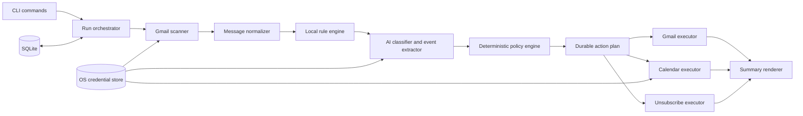

# Architecture

This document describes the system architecture defined in `CLAUDE.md` (the
source-of-truth design contract for this repository) and how it maps onto
the actual `src/` layout. If the two ever disagree, `CLAUDE.md` wins —
update this file to match it, not the other way around.

## What this is

`gmail` is a local, installable terminal application (npm package
`gmail-agent-cli`, binary `gmail`). It is not a web app, desktop GUI,
browser extension, hosted inbox service, or general-purpose email client.
It runs only when invoked, does not run as a background service, and
requires no server component.

## Pipeline, not an agent loop

The system is a fixed pipeline with a deterministic policy gate, not an
autonomous tool-calling loop. The AI classifier is one untrusted analysis
component: it receives no SDK client, credentials, function tools, shell,
network access, or prior conversation state, and it cannot directly
mutate Gmail or Calendar. It returns a typed assessment; a separate,
deterministic policy engine decides what — if anything — happens next.

```text
snapshot -> normalize -> explicit rules -> classify unresolved mail
         -> deterministic policy -> persist plan -> validate preconditions
         -> execute idempotently -> summarize
```



## Dependency direction

Dependencies point inward, toward `core/`. Vendor SDK adapters
(`gmail/`, `calendar/`, `ai/`, `auth/google-oauth.ts`) depend on the core
interfaces; `core/policy.ts` never imports Google SDK response types,
SQLite row shapes, or OpenAI response types. The abstraction boundary is
expressed as a small set of interfaces so a vendor could be swapped
without touching policy logic:

| Interface | Purpose | Location |
| --- | --- | --- |
| `Classifier` | One untrusted AI assessment per message | `src/ai/classifier.ts` |
| `CredentialStore` | OS-backed secret storage (Keychain / Credential Manager / Secret Service) | `src/auth/credential-store.ts` |
| `Clock` | Injected time source for deterministic, testable retry/DST behavior | `src/core/clock.ts` |

Gmail and Calendar access is not yet behind a formal `MailGateway`/
`CalendarGateway` interface in the current code — `src/gmail/*` and
`src/calendar/*` are called directly from commands and the orchestrator —
but they are isolated to those directories, and no `googleapis` types leak
into `src/core/*`.

## Module map

```text
src/
  cli.ts                 Commander entrypoint; `gmail` with no args == `gmail work`
  commands/               One file per CLI command; thin glue over core/gmail/calendar
    work.ts               `gmail work` — the default pipeline, dry-run or real
    spam.ts / important.ts  Rule creation + immediate application
    rules.ts, summary.ts, undo.ts, auth.ts, config.ts, doctor.ts
    shared.ts             Resolves the signed-in account + authenticated API clients
  core/
    models.ts             Domain types: NormalizedMessage, EmailAssessment, PlannedAction, RuleGroup, ...
    policy.ts             The deterministic action policy (see below) — pure, no I/O
    action-plan.ts         Turns policy decisions into durably-keyed PlannedAction rows
    orchestrator.ts        Wires scan -> normalize -> rules -> classify -> policy for `gmail work`
    ids.ts                 Deterministic action keys / Calendar event IDs / content hashes
    clock.ts, errors.ts, lock.ts, bootstrap.ts
  gmail/
    client.ts              Authenticated googleapis Gmail client factory
    scanner.ts              messages.list / messages.get / users.history.list wrappers
    normalize.ts            HTML->bounded plain text, header parsing, content hashing
    labels.ts                Gmail system label constants + protection-signal helpers
    executor.ts              trash / untrash / grouped batchModify mutations
  ai/
    classifier.ts            The `Classifier` interface
    not-configured-classifier.ts  Always-unavailable stub (see "AI status" below)
    schema.ts                 Zod Structured-Outputs schema for the (not yet wired) real classifier
  calendar/
    client.ts                 Authenticated googleapis Calendar client factory
    event-policy.ts            Real-code validation of AI-extracted event candidates (dates, duration, timezone)
    idempotency.ts              Deterministic event IDs, provenance, insert-with-409-reconciliation
  unsubscribe/
    headers.ts                 List-Unsubscribe / mailto: parsing and validation
    safe-http.ts                 SSRF-hardened HTTPS client for the RFC 8058 one-click POST
  rules/
    matcher.ts                  Evaluates one matcher / one rule group against a message
    resolver.ts                  Groups messages into subscription identities; conflict detection
    auth-signals.ts               Authentication-Results parsing for DKIM/DMARC-bound matchers
  state/
    database.ts                  SQLite open + pragma + migration runner
    migrations/                   Ordered, append-only schema migrations
    repositories/                  Typed CRUD over accounts / rule_groups / runs / actions
  auth/
    google-oauth.ts                Installed-app PKCE flow, loopback listener
    credential-store.ts             OS credential store interface + keytar-backed implementation
  summary/
    build-summary.ts                 Deterministic aggregation of one run's outcomes
    render-human.ts, render-json.ts   The two `--json` / human output modes
  config/
    schema.ts, paths.ts, load.ts       Non-secret config validated with Zod; OS-appropriate paths
  logging/
    logger.ts                          pino with redaction; progress goes to stderr
```

## The deterministic action policy

`src/core/policy.ts` (`evaluateMessagePolicy`) is the single place that
decides what happens to a message, applied in this precedence order:

1. An explicit local **spam** rule match plans Trash and nothing else —
   unless the message is protected (see below), which always wins.
2. Unprotected native Gmail Spam plans Trash without any AI call.
3. An authenticated high-risk signal (security/financial/etc.) gates the
   promotion/automated-low-value Trash path behind a real, usable
   assessment — a bulk-mail label alone can never trigger Trash for a
   vetoed message.
4. A high-confidence AI `promotion` / `automated_low_value` result plans
   Trash. `suspicious` / `unknown` / an unavailable assessment produce
   **no** AI-derived mutation at all (no trash, no star, no event) — only
   Review eligibility.
5. A qualifying importance score/confidence, or an explicit **important**
   rule, adds `STARRED` + `IMPORTANT`.
6. A qualifying, validated event candidate creates a Calendar event.

By product decision, every confidence threshold in
`DEFAULT_POLICY_THRESHOLDS` (`src/core/policy.ts`) is currently a uniform
**0.90** — lower than the design doc's original launch-precision defaults
(0.97/0.98/0.85/0.90/0.95). This trades some precision for more automation,
accepted specifically because every action is durably logged and fully
enumerable via `gmail summary <run-id>` (no truncation) and reversible via
`gmail undo` (except unsubscribe, which cannot be reversed by design).
7. Every remaining message that is read and still in the Inbox gets
   archived — even if it was starred or used to create an event. Trash is
   the only outcome mutually exclusive with everything else.

"Protected" means: a user-created important rule matches, or the message
carries a `STARRED`/`IMPORTANT` label this app's own ledger cannot
attribute to itself. Protected messages are never auto-trashed. This is
enforced in `policy.ts` and covered by unit tests in
`tests/unit/policy.test.ts` (e.g. "never trashes a protected message even
with an explicit spam rule").

## Data model (SQLite, `src/state/migrations/001_initial_schema.ts`)

One database per OS user, WAL mode, foreign keys on, `0600` permissions
enforced at open time (`src/state/database.ts` refuses to proceed if the
file is group/world-readable on POSIX platforms).

| Table | Purpose |
| --- | --- |
| `accounts` | Account hash, display email, timezone, Gmail history marker, setup/automation flags |
| `messages` | Per-message classifier/policy version projection (no bodies, no verbatim evidence) |
| `rule_groups` / `rule_matchers` | User-created spam/important categories and their concrete matchers |
| `runs` | One row per `gmail work`/`spam`/`important` invocation |
| `actions` | The durable action ledger — outbox pattern: `planned -> applying -> applied \| failed_* \| skipped_conflict \| unknown_no_retry` |
| `unsubscribe_attempts` | Per-subscription-identity attempt history (never retried automatically) |
| `calendar_links` | Account/message/candidate -> Calendar event ID + provenance |
| `settings` | Non-secret versioned settings only |

Secrets (OAuth refresh tokens, AI API keys) never enter this database —
they live only in the OS credential store, addressed via
`CREDENTIAL_KEYS` in `src/auth/credential-store.ts`.

## AI status in this build

Per an explicit project decision, the real OpenAI-backed classifier is
**not implemented**. `src/ai/not-configured-classifier.ts` always returns
`{ ok: false, unavailable: { reason: "not_configured" } }`. This is a
first-class, spec-anticipated state — `policy.ts` treats "assessment
unavailable" the same way it treats a refusal or schema failure: no
AI-derived Trash/star/important/event mutation, the message is flagged
for Review, and deterministic read-archiving still proceeds. The Zod
Structured Outputs schema (`src/ai/schema.ts`) and the `Classifier`
interface are in place so a real implementation can be dropped in behind
`ai/openai-classifier.ts` later without touching `core/policy.ts`.

### Pluggable provider (config surface only, not yet wired)

`config/schema.ts` already models `aiProvider` (`"openai"` or
`"openai-compatible"`) and `aiBaseUrl`, so a user is not required to hold
an OpenAI API key specifically once a real classifier exists: pointing
`aiBaseUrl` at any endpoint that implements the same Responses API +
Structured Outputs shape (e.g. a self-hosted model server) would work
without touching `core/policy.ts` or `core/orchestrator.ts` — only the
`Classifier` implementation `work.ts` constructs would change. Both
fields are currently inert; no classifier reads them yet.

## Command surface

See `CLAUDE.md`'s "Command-line contract" section for the authoritative
flag-by-flag behavior. Implementation status of each command lives in the
repository's commit history and README, not duplicated here to avoid
drift.

## Known deviations from the full design (as of this writing)

- No automated RFC 8058 DKIM-verified one-click HTTPS unsubscribe yet —
  `spam` falls back to manual/`mailto:` handling, which is the spec's own
  safe default when DKIM coverage can't be verified.
- No incremental Gmail `history.list` synchronization yet — `gmail work`
  does a full snapshot every run (correct, just not optimized).
- No interactive sender/message pickers — `spam`/`important` require an
  explicit category argument.
- No first-run onboarding wizard baked into the bare `gmail` invocation —
  it currently just directs an unauthenticated user to `gmail auth login`.
