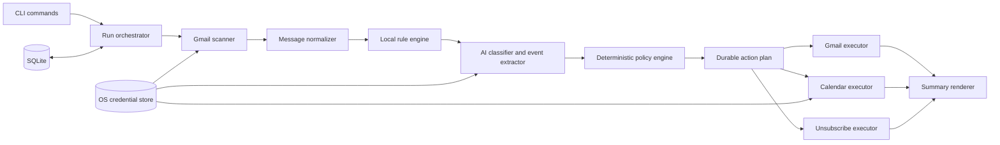

# Architecture

This document describes the system architecture defined in `CLAUDE.md` (the
source-of-truth design contract for this repository) and how it maps onto
the actual `src/` layout. If the two ever disagree, `CLAUDE.md` wins —
update this file to match it, not the other way around.

## What this is

`gmail` is a local, installable terminal application (npm package
`gmail-agent-cli`, binary `gmail`). It is not a web app, desktop GUI,
browser extension, hosted inbox service, or general-purpose email client.
It runs only when invoked, does not run as a background service, and
requires no server component.

## Pipeline, not an agent loop

The system is a fixed pipeline with a deterministic policy gate, not an
autonomous tool-calling loop. The AI classifier is one untrusted analysis
component: it receives no SDK client, credentials, function tools, shell,
network access, or prior conversation state, and it cannot directly
mutate Gmail or Calendar. It returns a typed assessment; a separate,
deterministic policy engine decides what — if anything — happens next.

```text
snapshot -> normalize -> explicit rules -> classify unresolved mail
         -> deterministic policy -> persist plan -> validate preconditions
         -> execute idempotently -> summarize
```



## Dependency direction

Dependencies point inward, toward `core/`. Vendor SDK adapters
(`gmail/`, `calendar/`, `ai/`, `auth/google-oauth.ts`) depend on the core
interfaces; `core/policy.ts` never imports Google SDK response types,
SQLite row shapes, or OpenAI response types. The abstraction boundary is
expressed as a small set of interfaces so a vendor could be swapped
without touching policy logic:

| Interface | Purpose | Location |
| --- | --- | --- |
| `Classifier` | One untrusted AI assessment per message | `src/ai/classifier.ts` |
| `CredentialStore` | OS-backed secret storage (Keychain / Credential Manager / Secret Service) | `src/auth/credential-store.ts` |
| `Clock` | Injected time source for deterministic, testable retry/DST behavior | `src/core/clock.ts` |

Gmail and Calendar access is not yet behind a formal `MailGateway`/
`CalendarGateway` interface in the current code — `src/gmail/*` and
`src/calendar/*` are called directly from commands and the orchestrator —
but they are isolated to those directories, and no `googleapis` types leak
into `src/core/*`.

## Module map

```text
src/
  cli.ts                 Commander entrypoint; `gmail` with no args == `gmail work`
  commands/               One file per CLI command; thin glue over core/gmail/calendar
    work.ts               `gmail work` — the default pipeline, dry-run or real
    spam.ts / important.ts  Rule creation + immediate application
    rules.ts, summary.ts, undo.ts, auth.ts, config.ts, doctor.ts
    shared.ts             Resolves the signed-in account + authenticated API clients
  core/
    models.ts             Domain types: NormalizedMessage, EmailAssessment, PlannedAction, RuleGroup, ...
    policy.ts             The deterministic action policy (see below) — pure, no I/O
    action-plan.ts         Turns policy decisions into durably-keyed PlannedAction rows
    orchestrator.ts        Wires scan -> normalize -> rules -> classify -> policy for `gmail work`
    ids.ts                 Deterministic action keys / Calendar event IDs / content hashes
    clock.ts, errors.ts, lock.ts, bootstrap.ts
  gmail/
    client.ts              Authenticated googleapis Gmail client factory
    scanner.ts              messages.list / messages.get / users.history.list wrappers
    normalize.ts            HTML->bounded plain text, header parsing, content hashing
    labels.ts                Gmail system label constants + protection-signal helpers
    executor.ts              trash / untrash / grouped batchModify mutations
  ai/
    classifier.ts            The `Classifier` interface
    not-configured-classifier.ts  Always-unavailable stub (see "AI status" below)
    schema.ts                 Zod Structured-Outputs schema for the (not yet wired) real classifier
  calendar/
    client.ts                 Authenticated googleapis Calendar client factory
    event-policy.ts            Real-code validation of AI-extracted event candidates (dates, duration, timezone)
    idempotency.ts              Deterministic event IDs, provenance, insert-with-409-reconciliation
  unsubscribe/
    headers.ts                 List-Unsubscribe / mailto: parsing and validation
    safe-http.ts                 SSRF-hardened HTTPS client for the RFC 8058 one-click POST
  rules/
    matcher.ts                  Evaluates one matcher / one rule group against a message
    resolver.ts                  Groups messages into subscription identities; conflict detection
    auth-signals.ts               Authentication-Results parsing for DKIM/DMARC-bound matchers
  state/
    database.ts                  SQLite open + pragma + migration runner
    migrations/                   Ordered, append-only schema migrations
    repositories/                  Typed CRUD over accounts / rule_groups / runs / actions
  auth/
    google-oauth.ts                Installed-app PKCE flow, loopback listener
    credential-store.ts             OS credential store interface + keytar-backed implementation
  summary/
    build-summary.ts                 Deterministic aggregation of one run's outcomes
    render-human.ts, render-json.ts   The two `--json` / human output modes
  config/
    schema.ts, paths.ts, load.ts       Non-secret config validated with Zod; OS-appropriate paths
  logging/
    logger.ts                          pino with redaction; progress goes to stderr
```

## The deterministic action policy

`src/core/policy.ts` (`evaluateMessagePolicy`) is the single place that
decides what happens to a message, applied in this precedence order:

1. An explicit local **spam** rule match plans Trash and nothing else —
   unless the message is protected (see below), which always wins.
2. Unprotected native Gmail Spam plans Trash without any AI call.
3. An authenticated high-risk signal (security/financial/etc.) gates the
   promotion/automated-low-value Trash path behind a real, usable
   assessment — a bulk-mail label alone can never trigger Trash for a
   vetoed message.
4. A high-confidence AI `promotion` / `automated_low_value` result plans
   Trash. `suspicious` / `unknown` / an unavailable assessment produce
   **no** AI-derived mutation at all (no trash, no star, no event) — only
   Review eligibility.
5. A qualifying importance score/confidence, or an explicit **important**
   rule, adds `STARRED` + `IMPORTANT`.
6. A qualifying, validated event candidate creates a Calendar event.
6a. A non-null `category` from the assessment proposes a topical **label**
    action — gated on a *separate*, run-wide batch-size check applied in
    `core/orchestrator.ts` after all messages are classified (see
    "Automatic topical labeling" below), not in `policy.ts` itself, since
    that decision needs to see every other message in the run.
6b. A message that actually gets a validated Calendar event also gets a
    deterministic "Calendar" label action and an archive action,
    regardless of read state — added in `orchestrator.ts`'s
    `finalizeOutcome`, right alongside the `calendar_create` prediction,
    the same way `calendar_create` itself is "predicted at policy time,
    executed later in `work.ts`."

By product decision, every confidence threshold in
`DEFAULT_POLICY_THRESHOLDS` (`src/core/policy.ts`) is currently a uniform
**0.90** — lower than the design doc's original launch-precision defaults
(0.97/0.98/0.85/0.90/0.95). This trades some precision for more automation,
accepted specifically because every action is durably logged and fully
enumerable via `gmail summary <run-id>` (no truncation) and reversible via
`gmail undo` (except unsubscribe, which cannot be reversed by design).
7. Every remaining message that is read and still in the Inbox gets
   archived — even if it was starred or used to create an event. Trash is
   the only outcome mutually exclusive with everything else.

"Protected" means: a user-created important rule matches, or the message
carries a `STARRED`/`IMPORTANT` label this app's own ledger cannot
attribute to itself. Protected messages are never auto-trashed. This is
enforced in `policy.ts` and covered by unit tests in
`tests/unit/policy.test.ts` (e.g. "never trashes a protected message even
with an explicit spam rule").

**Fixed bug (protection was blocking event/label extraction, not just
trash/star):** `evaluateMessagePolicy` used to gate its *entire*
AI-derived block — trash, star, Calendar event, and label — behind a
single `!isProtected` check, even though `CLAUDE.md` is explicit that
protection ("an important rule... can bypass importance classification
but not event extraction") should only suppress trash and the redundant
AI-derived star. Since Gmail's own ML frequently marks transactional and
appointment mail `IMPORTANT` on its own — exactly the mail most likely to
contain a real calendar event — this silently dropped calendar-event (and
topical-label) creation for a large, non-obvious slice of messages,
independent of confidence or any other setting. Trash-eligibility and the
AI-derived star/important addition are now gated behind `!isProtected`
individually inside the assessment block, while event extraction and
topical labeling are evaluated unconditionally whenever a usable
assessment exists — matching the precedence list above and the explicit
spec language. `POLICY_VERSION` was bumped (`policy-v4`) to invalidate
any assessment cached under the old behavior.

## Data model (SQLite, ordered migrations under `src/state/migrations/`)

One database per OS user, WAL mode, foreign keys on, `0600` permissions
enforced at open time (`src/state/database.ts` refuses to proceed if the
file is group/world-readable on POSIX platforms).

| Table | Purpose |
| --- | --- |
| `accounts` | Account hash, display email, timezone, Gmail history marker, setup/automation flags |
| `messages` | Per-message classifier/policy version projection, plus (migration 003) `subject`/`sender_display`/`internal_date`, migration 005 `category`, and migration 006 `assessment_had_event` — low-sensitivity metadata `gmail view`'s list reads from; still never a body or event payload |
| `label_candidates` | (migration 002, with migration 004 distinct-vote tracking) Cross-run cumulative counts for AI-guessed topical categories that haven't cleared `MIN_LABEL_BATCH_SIZE` yet |
| `rule_groups` / `rule_matchers` | User-created spam/important categories and their concrete matchers |
| `runs` | One row per `gmail work`/`spam`/`important` invocation |
| `actions` | The durable action ledger — outbox pattern: `planned -> applying -> applied \| failed_* \| skipped_conflict \| unknown_no_retry \| reversed` |
| `unsubscribe_attempts` | Per-subscription-identity attempt history (never retried automatically) |
| `calendar_links` | Account/message/candidate -> Calendar event ID + provenance |
| `settings` | Non-secret versioned settings only |

Secrets (OAuth refresh tokens, AI API keys) never enter this database —
they live only in the OS credential store, addressed via
`CREDENTIAL_KEYS` in `src/auth/credential-store.ts`.

## Incremental Gmail history synchronization

Implemented to address real Gmail API quota pressure: `runWorkScan`
(`src/core/orchestrator.ts`) now branches on `deps.historyMarker` (read
from `accounts.history_marker` by `work.ts` and passed straight through):

- **No marker, or it expired** (`listHistorySince` returns
  `expiredMarker: true` on Gmail's 404): `runFullScan` does exactly what
  the whole pipeline always did — list every Inbox/Spam message ID, fetch
  each, classify, decide. After the snapshot, it makes one extra
  `listHistorySince(gmailClient, profile.historyId)` call to catch
  anything that changed *during* that listing/fetch window (CLAUDE.md's
  fence-then-reconcile requirement), and returns that call's
  `endHistoryId` (or the original fence if nothing changed) as
  `newHistoryMarker`.
- **A valid marker**: `runIncrementalScan` calls `listHistorySince` once,
  takes the resulting `changedMessages` (a `Map<id, threadId>` —
  `listHistorySince` now preserves `threadId` straight from the history
  record instead of discarding it, since downstream code needs a real
  thread ID, not a guess), fetches only those messages, and filters to
  ones that *currently* carry `INBOX` or native `SPAM` before they ever
  reach the classifier — a message that changed for an unrelated reason
  (the user archived/trashed it themselves) is simply not evaluated, the
  same as it would never have appeared in a full `listAllMessageIds` pass
either. The Inbox "before" count for the summary comes from one cheap
`users.labels.get("INBOX")` call (`fetchInboxMessageCount`, 1 quota
unit) instead of a full listing.

Reply protection no longer calls `threads.get` for every Trash candidate.
`work.ts` builds a local set of thread IDs from one paginated
`messages.list(labelIds=[SENT])` pass, and the policy phase does a set lookup.
That is 5 quota units per list page instead of 40 units per candidate. If the
index cannot be read, the destructive action is held for Review; the direct
thread lookup remains only as a safe fallback for lower-level callers.

Both paths share the same `fetchAndNormalizeAll` (Phase 1) and
`classifyAndFinalize` (Phases 2-4) functions — history sync only changes
*which* message IDs are discovered, never how they're processed or
decided. `WorkScanResult.usedIncrementalSync` and `.scanNote` report which
path ran and how many messages were reconciled, printed to stderr and
folded into the human/JSON summary respectively.

`work.ts` only calls `AccountsRepository.updateHistoryMarker` with the
returned `newHistoryMarker` *after* `runsRepo.finish(...)` — i.e. only
once the run's plan/ledger is durable — and never in `--dry-run` (which
must not mutate durable state at all, per CLAUDE.md).

`gmail cache` (`src/commands/cache.ts`) is the explicit, read-only full
Inbox/Spam counterpart. It accepts an optional `--limit`, never calls the
classifier, and makes no Gmail/Calendar mutations. An uncapped, successful
snapshot refreshes the history-marker baseline; a limited or partially
failed snapshot leaves the baseline untouched. It upserts each visited
message's non-verbatim projection (`contentHash`, label snapshot,
`subject`/`senderDisplay`/`internalDate`, no body or assessment payload) into
the `messages` table via `MessagesRepository`, which `gmail view` reads
directly (see "gmail view" below). Its full lifecycle is visible on stderr:
discovery, an eight-worker full-message hydration pool, and final marker
reconciliation each have a progress state. The hydration pool overlaps network
latency, while the shared quota-weighted limiter still controls actual Gmail
request departure rate.

On the next `gmail work`, the cached rows are now read: unassessed rows and
rows whose classifier, prompt, schema, policy, rule, or custom-label context
is stale are unioned with Gmail history as a targeted backlog. Each such row
gets one live `messages.get(format="full")` hydration/evaluation pass, then
drops out of the backlog when its current evaluation is durably recorded.
Matching event-free assessments can skip the OpenAI call entirely on later
history changes. Event-bearing assessments are deliberately rehydrated,
because the event payload and source evidence are not persisted and cannot be
reconstructed safely. Deleted, inactive, trashed, and successfully archived
rows are evicted from the working-set cache.

### Adaptive Gmail rate limiting

`src/core/api-retry.ts`'s `GoogleApiRateLimiter` is a shared,
process-wide pacer every Gmail/Calendar call goes through via
`withGoogleApiRetry` (all Gmail/Calendar call sites —
`scanner.ts`, `executor.ts`, `custom-labels.ts`, `idempotency.ts`,
`work.ts`, `undo.ts` — switched from the plain `withApiRetry`; OpenAI
calls are untouched, a separate quota domain with their own budget in
`OpenAiClassifier`). Rather than hardcoding one "safe" requests/second
number — projects can retain either the legacy or new Gmail quota tier — it
starts at 5 baseline-equivalent messages/s and recovers toward 10/s (200
`messages.get`-equivalent units/second, or the explicit
`GMAIL_AGENT_RATE_LIMIT_RPS` value), halves itself on a quota-shaped failure
(429 or the Service Infrastructure quota-message pattern), and only creeps
back up after 25 consecutive clean calls. Calls reserve quota-weighted slots:
`messages.get` is weight 1, `threads.get` weight 2, `messages.list` weight
0.25, history weight 0.1, and labels weight 0.05. Ordinary network errors
reset the recovery streak without being misclassified as quota pressure, and
5xx responses retry without slowing the limiter. Concurrent callers reserve
distinct future slots, preventing a burst when several reads complete
together. Concurrency (`concurrency.gmailReads`) still controls how many
requests are *in flight*; the limiter controls how *fast* they're allowed to
leave. It is bypassed under Vitest so fake-client tests don't pay production
pacing delays.

## AI status in this build

The real OpenAI-backed classifier is implemented:
`src/ai/openai-classifier.ts`'s `OpenAiClassifier` makes one stateless
call to OpenAI's Responses API per unresolved message (`store: false`, no
tools, no `previous_response_id`). By product decision, the model fills
in a deliberately minimal, cheap wire schema (`src/ai/schema.ts`'s
`EmailFlagsSchema`) — a single `tag` enum (`spam`/`suspicious`/
`important`/`routine`, replacing an earlier version's three separate,
largely mutually-exclusive booleans — the prompt already said "at most
one of spam/suspicious should be true," so one enum field costs fewer
output tokens per call at the same information content) plus a few event
fields (event presence inferred from `eventTitle !== null`, no separate
`hasEvent` boolean, but `eventSourceEvidence` — a short quote required
whenever `eventTitle` is non-null — was kept/restored despite the
cost-driven compression: `core/orchestrator.ts` calls
`calendar/event-policy.ts`'s `sourceEvidencePresent` to verify that quote
is actually present in the normalized message before any Calendar event
is created, so a hallucinated date can't produce a real event just
because the model asserted one) and one short nullable string
(`category`) — no confidence floats, no free-text summary, no
reason-code array — parsed via `zodTextFormat`. It never receives
Gmail/Calendar credentials or the
ability to call anything — it returns the tag+fields, and
`openai-classifier.ts` deterministically maps them onto the richer
internal `EmailAssessment` shape `core/policy.ts` already knows how to
consume (fixed confidence values that clearly clear or miss its 0.90
thresholds; the tag *is* the decision, the policy engine's threshold
check is satisfied by construction — this schema change is purely an
output-shape/cost change, not a policy change). The `summary` field is no
longer AI-generated at all — `buildDeterministicSummary` in
`src/ai/prompt.ts` derives it from the subject and first non-blank line
of content, at zero token cost.

`src/ai/prompt.ts` holds `buildDeveloperInstructions(existingLabels)` —
the prompt-injection-hardened developer instructions (kept short — it's
sent on every call) plus, when the account has any custom Gmail labels, a
fixed suffix listing them so the model prefers reusing one over inventing
a near-duplicate; identical for every call within one run, so it's still
a fixed-prefix cost, not something that scales with mailbox size. It also
holds the untrusted user/input builder (excludes raw `List-Unsubscribe`/
`Authentication-Results` header values, only derived booleans; now
receives the message's real body when Gmail has one — see "Full message
body now fetched" below), and `FEW_SHOT_EXAMPLES` — a few labeled
input/output pairs sent as real prior turns before the actual message,
for the accuracy one-shot/few-shot prompting buys.

`normalizeCategoryLabel` (also in `prompt.ts`) trims/bounds the model's
free-text `category` guess before it's ever used as a real Gmail label
name; `openai-classifier.ts`'s `mapFlagsToAssessment` additionally forces
`category` to `null` whenever `suspicious` is true, regardless of what
the model returned for `category` — a phishing/scam message must never
be quietly filed under a friendly label.

Gmail-read concurrency and classifier-call concurrency are separate:
`OrchestratorDeps.concurrency` takes `{ gmailReads, aiCalls }`, and
`runWorkScan` (`core/orchestrator.ts`) processes messages in three
phases — fetch+normalize+rule-match (batched at `gmailReads`), then
classify only the non-bypassed subset (bounded at `aiCalls` via
`core/concurrency.ts`'s `mapWithConcurrency`, independent of the fetch
batch size), then pure policy evaluation. Gmail and an AI provider are
unrelated rate-limit domains, so sizing one off the other's batch size
was a bug; `work.ts` reads `aiCalls` from config (default 5 — raised
from an initial 2 once `OpenAiClassifier` itself gained retry/backoff,
so the higher concurrency doesn't cost accuracy under rate-limit
pressure). Immediately after phase 1, `preprocessed` is sorted
most-recent-first by `internalDate` before classification begins, so
both processing order and every downstream summary/output list newest
mail first regardless of the order Gmail's `messages.list` happened to
return it in.

`OpenAiClassifier.assess` (`src/ai/openai-classifier.ts`) wraps its
`responses.parse` call in `withApiRetry` (`src/core/api-retry.ts` —
renamed from `google-api-retry.ts` once it started being shared by both
the Google and OpenAI SDKs, both of which expose `.status`/
`.response.headers.get()` in a compatible shape) with a smaller retry
budget than the generic retry default (3 attempts, 500ms/8s backoff) — this
call runs once per message, so a
worst-case full backoff cycle here is directly felt as "the whole run
is slow," unlike a single Gmail list-page retry.

`src/ai/resolve-classifier.ts` decides which classifier a run actually
uses: if a usable API key is found (the OS credential store first, under
`CREDENTIAL_KEYS.aiApiKey(accountHash)`, then the `OPENAI_API_KEY`
environment variable — the same one the OpenAI SDK itself defaults to),
`work.ts` uses `OpenAiClassifier`; otherwise it falls back to
`src/ai/not-configured-classifier.ts`, which always returns
`{ ok: false, unavailable: { reason: "not_configured" } }`. `policy.ts`
treats that identically to a refusal or schema failure — no AI-derived
mutation, the message is flagged for Review, and deterministic
read-archiving still proceeds. Presence of a usable key is currently both
necessary and sufficient to opt in; `config.aiEnabled` is not consulted
(there's no exposed command to toggle it yet, so gating on it would just
add a confusing extra step with no way to satisfy it).

`src/ai/random-classifier.ts` — a uniformly random (but correctly-shaped)
`Classifier`, used earlier in this project to exercise the full pipeline
without any API key — still exists but is no longer wired into `work.ts`.
It remains useful for testing the trash/star/archive/Calendar-creation
paths without spending API calls; **never point it at a real mailbox**.

### Full message body now fetched

`core/orchestrator.ts`'s `fetchAndNormalize` calls `fetchMessageFull`
(`format=full`) instead of `fetchMessageMetadata` (`format=metadata`) for
every message, bypassed or not — Gmail's `messages.get` costs the same 20
quota units regardless of `format`, so this is strictly more information
(the real body, via `extractBodyParts`) at no extra request-count or
quota cost, only larger response payloads for messages that turn out to
be bypassed. This is what actually lets event/calendar detection see real
message content instead of only Gmail's short snippet.
`fetchMessageMetadata` itself is unchanged and still exported from
`gmail/scanner.ts`, just no longer called from the orchestrator.

### Automatic topical labeling

`core/policy.ts` pushes a `label` `PolicyActionIntent` (`{ reasonCode:
"ai_category:<name>", labelName }`) whenever a non-suspicious assessment
carries a non-null `category`, gated by the same `!isUnresolvedKind`
check as star/important/event — so it's never proposed for a
trash-eligible or suspicious/unknown message. This is only a *candidate*:
`core/orchestrator.ts`'s `applyLabelBatchThreshold`, run once after every
message in the scan has been classified, groups these by
case-insensitive `labelName` and lets a group through when either (a) its
name already matches one of the account's `existingLabels` — a label that
already exists needs no threshold, applying it to more mail is just
correctly reusing it, not creating clutter — or (b) its *cumulative*
count (this run's occurrences plus whatever was already accumulated from
earlier runs, tracked in the `label_candidates` table via
`LabelCandidatesRepository`) reaches `MIN_LABEL_BATCH_SIZE` (10). Every
surviving group is normalized to one exact display name. `work.ts`
persists each run's updated counts afterward (cleared once a category
crosses the threshold and gets applied — from then on `existingLabels`
alone keeps applying it). **Fixed bug:** an earlier version only counted
occurrences within a single run, with no cross-run accumulation — since
an incremental scan (the common case after the first run) typically only
reconciles a handful of changed messages at a time, a brand-new category
could almost never reach 10 in any single run, silently disabling new
topical labels entirely once an account moved past its first full scan.
A message that gets a validated Calendar event separately,
unconditionally gets a `calendar_label:Calendar` label action and an
`archive` action added directly in `finalizeOutcome` (not subject to the
batch-size check, since it's a deterministic 1:1 consequence of a real
event, not a guess).

`gmail/custom-labels.ts` is the only place that talks to Gmail's label
API: `listUserLabels` (filtered to `type: "user"`, read-only, safe in
`--dry-run`) and `getOrCreateLabelId`, which matches case-insensitively
against a caller-supplied `Map` before ever calling `labels.create`, and
falls back to re-listing on an HTTP 409 (a name created concurrently,
e.g. by the user in the Gmail UI mid-run) rather than failing. `work.ts`
only calls `getOrCreateLabelId` — i.e. only actually creates a label —
inside its `!options.dryRun` branch, after threshold filtering has
already happened; a name that fails to resolve (a transient Gmail error)
is simply left out of that run's mutations rather than failing the whole
run. `gmail/executor.ts`'s `labelOnlyMutation(labelId)` and `work.ts`'s
extended `mutationForActions` fold label additions into the same
`applyGroupedLabelMutations` batch as star/important/archive, so a
message needing several of these gets one combined `batchModify` call,
not several.

### Pluggable provider

`config/schema.ts` models `aiProvider` (`"openai"` or
`"openai-compatible"`) and `aiBaseUrl`. `resolve-classifier.ts` reads
both: with `aiProvider: "openai-compatible"` and `aiBaseUrl` set,
`OpenAiClassifier` is constructed with that `baseURL` instead of
OpenAI's endpoint, so a self-hosted or alternate provider implementing
the same Responses API + Structured Outputs shape works without an
OpenAI-specific key or any code change.

## Command surface

By product decision, the CLI currently exposes only two commands, to keep
the MVP surface small:

- **`gmail`** (with `--dry-run` / `--json` / `--limit <n>`) — the whole
  product: scans, classifies, decides, and acts, exactly as `CLAUDE.md`
  describes for `gmail work`. Also performs sign-in inline the first time
  it's run — there is no separate `gmail auth login` command in this
  build. `--limit` caps the Inbox and native-Spam scans to the N most
  recent messages *each*, applied before any per-message `messages.get`
  call (via `listAllMessageIds`'s `safetyCapCount`, in
  `src/gmail/scanner.ts`) — that's what actually bounds Gmail API quota
  usage, not just how many list pages get fetched.
- **`gmail add <spam|important> <category...>`** — a single unified entry
  point over what `CLAUDE.md` specifies as two separate commands
  (`gmail spam` / `gmail important`); it dispatches to the same
  underlying logic in `src/commands/spam.ts` / `src/commands/important.ts`.
  Accepts one or more category arguments (Commander's `[categories...]`
  variadic syntax) — `runAdd` (`src/commands/add.ts`) loops over them,
  running each as its own fully independent `runSpam`/`runImportant`
  call; one category's failure (no matches, a conflict, etc.) doesn't
  stop the rest, and the command's exit code reflects the worst
  individual result.
- **`gmail category <names...>`** (`src/commands/category.ts`) — creates
  (or reuses, case-insensitively) one or more real Gmail labels
  immediately via the same `gmail/custom-labels.ts` helpers `work.ts`
  uses, with no message search and no batch-size threshold. It exists so
  a user can pre-seed a label they want the AI auto-labeling in a normal
  `gmail` run to start reusing right away, rather than waiting for the
  10-message threshold to invent and clear it from scratch. Acquires the
  same per-account process lock as every other mutating command.
- **`gmail cache`** (`src/commands/cache.ts`) — a full, read-only Inbox +
  Spam snapshot with no AI calls and no Gmail/Calendar mutations, purely
  to (re)establish a fresh Gmail history-marker baseline (see "Incremental
  Gmail history synchronization" below) and record each visited message's
  non-verbatim projection into the local `messages` table via the new
  `MessagesRepository` (`src/state/repositories/messages.ts`) — content
  hash and label snapshot only, never body text, matching CLAUDE.md's
  "keep... full email bodies... out of SQLite." Exists so a user under
  Gmail API quota pressure can pay the expensive full-traversal cost once,
  explicitly, and have every subsequent `gmail`/`gmail work` run scan
  incrementally instead.
- **`gmail uncache`** (`src/commands/uncache.ts`) — the inverse: deletes
  this account's rows from `messages` and `label_candidates`
  (`MessagesRepository.clearForAccount` /
  `LabelCandidatesRepository.clearForAccount`, both new) and resets
  `accounts.history_marker` to `null`
  (`AccountsRepository.updateHistoryMarker` now accepts `null`). Zero
  Gmail/Calendar API calls — purely local state, so it's exactly as safe
  to run as it is to skip. Requires confirmation unless `--yes`. The next
  scan afterward takes the same `runFullScan` path as an account's
  first-ever run or an expired marker.
- **`gmail view`** (`src/commands/view.ts`) — an interactive terminal
  browser over `gmail cache`'s local data; see "gmail view" below.

### `gmail view`

Reads `MessagesRepository.listForAccount` once at startup — every
list/page/tag-filter interaction after that is pure in-memory
filtering/pagination, no Gmail calls. Live Gmail calls happen only for
two actions: opening a message (`fetchMessageFull`, never persisted) and
sending a reply.

- **List**: `renderList` prints numbered subject/sender/unread-marker
  rows for the current page; `t` opens a `@clack/prompts` `multiselect`
  over every distinct label seen across cached messages (`collectDistinctTags`)
  to toggle which are hidden; `n`/`p`/`l <n>` handle paging and page size.
- **Read**: selecting a number does a live `format=full` fetch, normalizes
  it exactly like every other pipeline (`buildNormalizedMessage`,
  `extractBodyParts`), and renders it. `src/core/keypress.ts`'s
  `waitForKeypress` puts stdin into raw mode for exactly one keypress at a
  time (restoring the prior mode immediately after) — used to detect
  `esc` (back to list), a bare `r` (manual reply), or `;` followed by `r`
  within one second (AI-drafted reply), all without pulling in a full TUI
  framework.
- **Reply**: `src/gmail/reply.ts`'s `buildReplyTarget` derives recipient
  (`Reply-To` preferred over `From`), `Re:`-prefixed subject, and
  `In-Reply-To`/`References` threading headers purely from the
  already-parsed `NormalizedMessage` — never from AI output, never from
  body content (see CLAUDE.md's "Interactive reply" for why this is the
  concrete anti-injection property). `sendReply` builds the raw MIME
  message and calls `messages.send` with the original `threadId`; nothing
  calls it without `confirmAndSend` first showing the exact To/Subject/Body
  and getting an explicit `y` — there is no default-yes and no path that
  skips this. The process lock is held only around the send call itself,
  not the whole interactive session (browsing/reading needs no
  exclusivity; sending a real Gmail mutation does).
- **AI-drafted reply**: `src/ai/draft-reply.ts`'s `draftReply` is a
  separate, direct OpenAI Responses call (not through the `Classifier`
  interface) — stateless, `store: false`, no tools, the source email
  isolated in `input` with explicit instructions to ignore anything in it
  that looks like a directive, matching the classifier's own
  prompt-injection posture. It returns body text only (or `null` on any
  failure, which the caller treats as "fall back to a manual reply") and
  is never asked for a recipient/subject — `confirmAndSend` and
  `buildReplyTarget` are reused unchanged from the manual-reply path, so
  the AI draft goes through the exact same review-before-send gate.

Every `gmail` run's summary (`src/summary/build-summary.ts`) carries,
in addition to the per-action-type detail lists, two sections built
purely from in-memory outcomes at zero extra API/AI cost: a
`recentUnread` list (the most-recent 10 unread messages regardless of
what happened to them, relying on the orchestrator's most-recent-first
ordering — a quick "what's actually new" glance without reading the
whole run) and an `unchanged` list (every message that received no
action and wasn't flagged for Review either, uncapped — so a message
can never silently vanish from the summary between "acted on" and
"needs review").

`gmail work` also renders a live classifier progress bar on stderr, emits a
plain executive plan before executing Gmail/Calendar mutations, and ends
every run with one concise plaintext paragraph containing every message
marked important (or an explicit "none identified" sentence). JSON output
remains valid on stdout; these human-facing progress/plan/important lines go
to stderr in `--json` mode.

The other commands `CLAUDE.md` specifies — `rules`, `summary`, `undo`,
`auth`, `config`, `doctor` — are **not removed**, just not registered in
`src/cli.ts` yet. Their implementations still exist under `src/commands/`
and still work; re-adding them to `cli.ts` is a small, low-risk change
whenever they're back in scope. `runWork` (`commands/work.ts`) already
calls into `commands/auth.ts`'s `authLogin` directly for the inline
sign-in flow, so that logic isn't duplicated.

## Real-world Gmail quota incidents (post-review)

Two further fixes came from an actual `gmail cache`/`gmail work` crash in
live use, both in `src/core/api-retry.ts`:

- Google's Service Infrastructure quota error ("Quota exceeded for quota
  metric 'Total Query Cost' and limit 'Units per minute per user' of
  service 'gmail.googleapis.com'...") reaches this code as a bare `Error`
  with no numeric `.status` the existing retry check recognized, so it
  was retried zero times and crashed whichever call hit it. Added
  `isRetryableGoogleQuotaMessage`, matching this message shape by text —
  but only for a per-second/per-minute/per-100-seconds limit; a
  daily/lifetime quota error with the same shape is deliberately left
  alone since it won't clear within one process's retry budget.
- Separately, the *default* retry budget (`maxAttempts: 5`) only ever
  accumulated ~15s of total backoff (1+2+4+8s across the four waits
  before the fifth and final attempt throws immediately) — nowhere near
  long enough for a "per minute" quota to actually clear. Raised to
  `maxAttempts: 7` (~61s of accumulated backoff: 1+2+4+8+16+30s),
  comfortably spanning a full minute. This is the shared default every
  Gmail/Calendar call uses unless it passes its own `RetryOptions`
  (`OpenAiClassifier` still overrides with its own tighter budget,
  unaffected by this change).
- The crash itself also exposed a design gap, independently fixed:
  `runFullScan`'s and `gmail cache`'s post-scan `listHistorySince`
  reconciliation call (see "Incremental Gmail history synchronization"
  above) had no error handling at all — a failure there (even after
  retries are exhausted) crashed the whole command *after* already
  paying for the entire expensive message-fetching traversal, with no
  history marker ever persisted, so the next run would pay the same cost
  again. `resolvePostScanHistoryMarker()` now wraps that call and falls
  back to the pre-scan fence historyId on any failure, letting the run
  complete and its results (a `gmail cache` run's already-cached
  messages, a `gmail work` run's classify/policy results) survive.

## Bug-fix pass (full-codebase review)

A full-codebase bug-hunt review surfaced and fixed the following, each
covered by new regression tests:

- **`ProcessLock` TOCTOU race** (`src/core/lock.ts`): `acquire()` used to
  `existsSync` then separately `writeFileSync`, so two processes launched
  close together could both observe "no lock" and both proceed. Now uses
  an atomic exclusive-create write (`flag: "wx"`), handling `EEXIST` by
  checking the existing PID's liveness and retrying the atomic create if
  stale.
- **Multi-account ambiguity**: `resolveAccount`'s account lookup had no
  `ORDER BY`, and nothing ever enforced v1's "exactly one signed-in
  account" invariant, so a stale row could linger after a fresh sign-in
  as a different Google account and `resolveAccount` had no principled
  way to pick between them. `authLogin` now deletes every other account
  row (and its stored credential) on a successful sign-in;
  `resolveAccount` orders by `updated_at DESC` as defense in depth.
- **`gmail undo`, `auth login`, `auth logout`, `rules remove` never
  acquired the per-account process lock** despite CLAUDE.md explicitly
  requiring it for all four (they mutate Gmail, credentials, or rule
  state). All four now do. `rules remove` is also now scoped to the
  resolved account (`RuleGroupsRepository.remove(accountHash, id)`) so it
  can never delete a different account's rule group.
- **`gmail add`'s multi-category loop aborted on the first conflict**,
  contradicting its own "continue independent actions" doc comment —
  `RuleConflictError` and other typed `GmailAgentError`s from one category
  weren't caught by the loop. Now caught per-category; only a genuinely
  unexpected (non-`GmailAgentError`) exception still aborts the command.
- **`gmail undo` never marked a reversed action as reversed** in the
  ledger — a new `"reversed"` `ActionStatus` is now set on every
  successful undo.
- **"Inbox: X before -> Y after" was arithmetically wrong** whenever
  native-Spam messages were trashed alongside Inbox activity: the
  subtraction used the *total* trashed count, which includes native-Spam
  trashes that were never part of the Inbox count to begin with. A new
  `RunSummary.inboxTrashedCount` (only messages that actually carried
  `INBOX` at snapshot time) fixes the subtraction in both renderers.
- **Three all-day Calendar event bugs** (`calendar/event-policy.ts`): an
  explicit end date wasn't bumped to Google's required *exclusive* end
  date (a 3-day event was stored as 2 days); a same-day event
  (`start === end`) was always rejected as non-positive duration; and any
  all-day event dated *today* was always rejected as a past event (an
  all-day candidate parses to midnight, which is always earlier than the
  current instant later that same day). All three fixed by treating
  `candidate.end` as an inclusive last day (always `+1` for the real,
  exclusive end) and comparing an all-day start against start-of-today
  rather than the exact instant.
- **A changed Calendar event was silently kept stale instead of flagged
  for review** (`calendar/idempotency.ts`): a 409 from this app's own
  prior event with a *different* payload hash (e.g. a corrected date
  after reclassification) used to be treated as `already_applied_by_this_app`
  rather than the `collision` its own documented contract calls for.
- **DKIM alignment wasn't actually checked** for important-rule auth
  bindings (`rules/auth-signals.ts`): the DKIM branch accepted any passing
  signature's domain, unlike the DMARC branch, which already required it
  to match the sender's address domain. A message routed through a shared
  ESP that DKIM-signs as its own domain could pass this and bind a rule
  to an unrelated (and impersonable) domain. Both branches now require
  exact alignment.
- **The redaction-enforcing `pino` logger was constructed but never
  called anywhere** — every real diagnostic went through raw
  `console.log`/`console.error`, including `cli.ts`'s top-level
  catch-all, which could print an unredacted token embedded in an SDK
  error's message/stack. `logging/logger.ts` now also exports
  `redactSecrets(text)`, applied to that catch-all's output.
  `bootstrap.ts` now constructs it with `{ toFile: true }` (a dedicated
  log file, so structured JSON lines don't interleave with the CLI's own
  human-readable stderr progress output) and `commands/work.ts` calls it
  at run start, scan completion, and run finish with content-free counts
  (run ID, account hash, status, trashed/label/calendar/failure counts).
  Wiring it through every remaining command (`spam`/`important`/`cache`/
  etc.) remains unaddressed.
- **`gmail add spam`'s search never actually searched Spam**: `includeSpamTrash`
  was never set (Gmail's API default is `false`), so a query built around
  `in:spam` silently never matched a spam-labeled message regardless of
  what the query string said. Both `spam.ts` and `important.ts` also had
  a hardcoded `maxResults: 50` with no pagination and no truncation
  notice; both now paginate (via `listAllMessageIds`, reused from
  `gmail/scanner.ts`) up to a 500-message safety cap and print a note
  when truncated.
- **`gmail cache` had no safety cap at all** — added an optional
  `--limit`, printed as a note (never silent) when it truncates.
- **`contentHash` was contaminated with label state**: it hashed
  `labelIds` alongside actual content, so a label-only change (by far the
  most common kind of change surfaced by incremental Gmail history sync)
  also changed "content changed," defeating the hash's purpose. Labels
  are already tracked separately as `label_snapshot`; `contentHash` no
  longer includes them.
- **Duplicate header handling**: `headerMapFromList` kept whichever
  occurrence of a repeated header (e.g. `Authentication-Results`) came
  last; now keeps the first, matching physical header order (a receiving
  server's own added header is prepended, so it appears first).
- **Unclosed `<script>`/`<style>` tags bypassed HTML stripping entirely**:
  the paired-tag regexes simply don't match with no closing tag, letting
  raw script/style content through as if it were message text.
  `htmlToBoundedPlainText` now also strips an unclosed opening tag through
  the rest of the document as a fallback.
- **`ActionsRepository.updateStatus` double-counted `attempt_count`**: it
  incremented on every call, so a single successful attempt (one
  `"applying"` transition, one terminal transition) read as 2. Now only
  increments on the transition into `"applying"`.
- **`fetchAndNormalize` trusted the caller-supplied stub's `threadId`**
  instead of the freshly-fetched response's — harmless for a full scan
  (where the stub comes from a real `messages.list` result) but wrong in
  principle for the incremental-scan path, where the stub is built from a
  `history.list` record. Now always uses `raw.threadId` from the fetch.
- Minor/low-severity: the OpenAI classifier's `event` fields weren't
  nulled for a suspicious message (only `category` was) — now symmetric,
  as defense in depth alongside `policy.ts`'s existing gate; the
  existing-labels list sent to the model joined names with unescaped
  commas (a label literally containing a comma could misread as two
  labels) — now quoted; the unsubscribe SSRF check was missing
  `100.64.0.0/10` (RFC 6598 carrier-grade NAT); the angle-bracket address
  regex didn't span an embedded newline in a display name.

## Second bug-hunt pass: fixes applied

A second full-codebase review (five parallel reviewers covering `gmail
view`/reply/draft-reply, the Gmail rate limiter and its call sites, the AI
schema/prompt/classifier, the state layer and label-batch threshold
wiring, and a general sweep of everything else) found and fixed:

- **Two CLAUDE.md-mandated protection signals were permanently dead**:
  `threadHasUserSentMessage` was hardcoded `false` everywhere and
  `isProtected` never even read it, so a thread the user had replied in
  got no protection from later AI-driven trash; `hasAuthenticatedHighRiskSignal`
  was hardcoded `false`, so the safety veto in `policy.ts` for
  authenticated security/financial/travel mail could never fire. Fixed:
  `gmail/scanner.ts`'s `fetchThreadHasUserSentMessage` (a `threads.get`
  call checking for Gmail's own `SENT` label on any message in the
  thread, memoized per run by threadId) now feeds `isProtected` in
  `core/orchestrator.ts`; a new deterministic `core/high-risk-signal.ts`
  (aligned-DKIM/DMARC-authenticated sender AND a matched high-risk
  content pattern — a keyword alone is deliberately never enough) now
  feeds the veto. Both are evaluated in real code, never from AI output.
- **CRLF header injection into an outbound reply** (`gmail/reply.ts`):
  neither the parsed recipient nor the subject/`Message-ID` were checked
  for embedded `\r`/`\n` before being spliced into the raw RFC 5322
  header block, so a crafted `Reply-To`/`Subject` could inject an extra
  header (e.g. `Bcc`) into the user's own reply. `buildReplyTarget` now
  refuses to build a target at all when the resolved address itself
  contains CR/LF (matching `unsubscribe/headers.ts`'s existing mailto
  handling), and every other header value is passed through a
  `sanitizeSingleLineHeader` helper. The reply body's
  `Content-Transfer-Encoding` was also missing (defaulting to invalid
  `7bit` for a non-ASCII body); it's now `base64` (with RFC 2045 76-char
  line wrapping) whenever the body isn't pure ASCII.
- **Four real Gmail API calls bypassed both retry and the adaptive rate
  limiter**: `spam.ts`/`important.ts`'s `searchRecentCandidates` (a
  `messages.get` loop over up to 500 search hits), `spam.ts`'s `mailto:`
  unsubscribe send, and `summary.ts`'s per-action `messages.get` were
  never touched by the earlier `withApiRetry` → `withGoogleApiRetry`
  migration. All four now go through `withGoogleApiRetry`.
- **Cross-run label-candidate double-counting**: `label_candidates` only
  stored a raw running total with no per-message dedup, so a message
  reclassified again by a later incremental sync (e.g. because it was
  separately starred, generating its own history event) could vote
  toward the 10-message threshold more than once. A new
  `label_candidate_votes` table (migration 004) and
  `LabelCandidatesRepository.recordVotes`/`listVotedMessageIdsForAccount`
  now dedup by `(account, category, gmailMessageId)`. The same fix pass
  also stopped `work.ts` from clearing a candidate row when the count
  crossed threshold but the actual `getOrCreateLabelId` call failed that
  run — it now keeps counting instead of silently discarding progress.
- **`ActionsRepository.upsertPlanned` silently reset `attempt_count` and
  `status` on every re-plan of a still-unresolved action**: the caller
  always constructs a fresh `PlannedAction` with `attemptCount: 0`, and
  the old `ON CONFLICT` clause blindly applied that to the stored row —
  empirically confirmed to reset a real `attempt_count: 1` back to `0`
  on the very next run. `attempt_count` is no longer in the `UPDATE SET`
  list at all; only `run_id`, a literal `status = 'planned'`, and a
  cleared `error_class` are updated.
- **AI tag→`kind` mapping collapsed `"important"` and `"routine"` into
  the same `personal_routine` kind**, producing a self-contradictory
  reason code (`ai_importance_personal_routine`) on star/important
  actions. `"important"` now maps to `personal_important`.
- `core/keypress.ts`'s `waitForKeypress` used to hang forever with no
  diagnostic when stdin isn't a TTY; it now rejects immediately, and
  `commands/view.ts` checks `process.stdin.isTTY` up front.
- `normalizeCategoryLabel` (`ai/prompt.ts`) only stripped `\r\n\t` from
  the model-controlled category string before it became a real Gmail
  label and hit the terminal; it now strips all C0/C1 control characters.
- `sourceEvidencePresent` (`calendar/event-policy.ts`) was dead code —
  the earlier wire-schema compression stopped asking the model for
  `sourceEvidence` at all, so CLAUDE.md's required hallucinated-date
  defense had nothing left to validate against. Restored as
  `eventSourceEvidence` in the wire schema (required whenever
  `eventTitle` is non-null; `schema-v5`/`prompt-v5`), and
  `core/orchestrator.ts` now calls `sourceEvidencePresent` before
  `validateEventCandidate`, downgrading to Review
  (`event_validation_failed_missing_source_evidence`) when the model's
  claimed evidence isn't actually present in the message.
- The Gmail rate limiter's default (`DEFAULT_GOOGLE_REQUESTS_PER_SECOND`
  in `core/api-retry.ts`) was an unfounded `8`; this pass changed it to a
  conservative `2`, grounded in Gmail's currently-published per-user quota
  (6,000 units/minute = 100 units/second) and this app's dominant
  per-message calls (`messages.get` at 20 units, `threads.get` —
  newly added in this same pass for thread-reply protection — at 40
  units), targeting roughly half that budget for headroom. **This default
  was itself replaced in the very next pass below** once the
  `threads.get` call that motivated it was made lazy instead of
  unconditional.
- Minor/low-severity: a dead `message.snippet` fallback in `view.ts`'s
  `renderMessage` (the type is non-nullable, so the "(no content)"
  placeholder could never show — now checks length instead); a low-level
  network error (`ECONNRESET` etc.) fed neither the rate limiter's
  backoff nor its recovery streak — it now resets the recovery streak
  without triggering backoff, since it isn't a quota signal;
  `GoogleApiRateLimiter`'s constructor had no guard against a
  non-positive rate (defense in depth only — the one real call site was
  already validated); the now-effectively-dead
  `autoTrashAutomatedLowValueConfidence` policy threshold (only
  `RandomClassifier` can still produce that kind) is now documented as
  such rather than silently doing nothing.

## Third fix pass: latency and cache-utilization

Reported symptom: `gmail`/`gmail work` still felt too slow, and the
previously-added `gmail cache` scan cache appeared to do nothing but store
data — a follow-up run seemed to redo the same work from scratch. Both
turned out to be real, and both were traced to identifiable causes rather
than tuned away by guessing:

- **The unconditional `threads.get` call from the prior pass was the
  single biggest new cost.** It was added so every message could be
  checked for "does this thread already contain a message the user sent"
  (thread-reply protection) before any Trash decision — correct for
  safety, but it ran for *every* message, not just ones actually headed
  for Trash, doubling the Gmail quota cost of a typical run (`messages.get`
  at 20 units plus an unconditional `threads.get` at 40 units, vs. 20
  alone) and adding a full extra network round trip per message.
  `core/orchestrator.ts`'s `finalizeOutcome` now defers this call: it
  first evaluates policy using only the cheap, already-known protection
  signals (explicit important rule, a preexisting `STARRED`/`IMPORTANT`
  label not attributable to this app), and only calls (and memoizes,
  per-thread, across the whole run) `fetchThreadHasUserSentMessage` when
  that first pass would actually plan a Trash action — the one case where
  the extra signal can change the outcome. Every non-Trash-bound message
  now costs exactly what it did before thread-reply protection existed.
- **`gmail work` never actually read what `gmail cache` wrote.**
  `grep -rln "MessagesRepository" src` before this pass showed `work.ts`
  never importing the `messages` table repository at all — the per-message
  content hash, label snapshot, and (once classified) assessment that
  `gmail cache`/`gmail work` persisted were write-only. CLAUDE.md's AI
  assessment contract already specified the fix ("Cache assessments using
  content and version hashes") but it had never been wired up: every run
  re-classified every unresolved message with a fresh OpenAI call
  regardless of whether that exact message, under the exact same
  classifier/prompt/schema/policy versions, had already been classified on
  a previous run. `core/orchestrator.ts`'s `classifyAndFinalize` now
  checks a `cachedAssessments` map (keyed by Gmail message ID, loaded by
  `work.ts` from `MessagesRepository`) before calling the classifier: a
  cache hit requires the stored content hash and all four version
  identifiers (`classifierVersion`, `promptVersion`, `schemaVersion`,
  `policyVersion`) to match exactly, and reconstructs the assessment
  (`reconstructAssessment`) without any AI call at all. A hit never
  reconstructs a real Calendar event from cache (`event.intent` is always
  `"none"` on a cache hit) — an event is a real mutation with its own
  idempotency machinery below, and CLAUDE.md forbids persisting
  `sourceEvidence` verbatim, so there is nothing safe to reconstruct an
  event from. Every scanned message's fresh-or-reused assessment is written
  back via `MessagesRepository.upsert` at the end of a non-dry-run
  `gmail work`, so the cache keeps compounding across runs instead of only
  ever being populated by `gmail cache`. `ResolvedClassifier` now reports
  real `classifierVersion`/`promptVersion`/`schemaVersion` values (previously
  hardcoded `"not-configured"` placeholders that could never match anything),
  and migration `005_message_category.ts` adds the `category` column the
  `messages` table needed to round-trip the AI-proposed topical label
  through a cache hit.
  The cache read also now queues `gmail cache`-only placeholders and stale
  rows alongside history changes, so the stored IDs drive one targeted live
  hydration instead of becoming write-only metadata. Migration 006 records
  whether an assessment had an event candidate; event-bearing and legacy
  unknown rows are rehydrated because their payload/evidence is intentionally
  not persisted. Matching event-free rows can skip OpenAI, while deterministic
  or intentionally unconfigured evaluations record their current versions so
  they do not remain in the backlog forever. Rule-group and custom-label
  context is included in the cache-policy hash, and deleted/inactive/actioned
  rows are evicted from the working set.
  - Fixing this exposed a real latent bug in `gmail cache` itself: its
    `messagesRepo.upsert` unconditionally nulled every assessment field on
    every run. Since CLAUDE.md explicitly recommends re-running
    `gmail cache` under quota pressure, doing so would have silently wiped
    out the very cache this pass just built. `cache.ts` now reads the
    existing row first and preserves its assessment fields whenever the
    content hash is unchanged; only a genuinely changed message gets a
    blank (correctly stale) assessment.
- **The rate limiter's recovery ceiling was capped at its own cold-start
  guess.** `GoogleApiRateLimiter.reportSuccess()` previously crept back up
  only as far as the constructor's single `initialRequestsPerSecond`
  value — so a conservative cold-start rate (chosen defensively, before
  actual quota headroom is known) could never be exceeded no matter how
  long a run went or how many requests succeeded in a row. The constructor
  now takes an optional third `fastestRequestsPerSecond` ceiling
  (`core/api-retry.ts`); `reportSuccess()` recovers toward that ceiling
  instead of the start rate, so a long-running command like `gmail cache`
  can adaptively discover and climb to an account's real throughput over
  its own execution instead of being frozen at a pessimistic guess for its
  entire duration. Omitting the third argument preserves the old
  single-plateau behavior exactly (verified by the existing "never
  recovers past its original rate" test, still passing unchanged). The
  singleton's defaults changed from a single `DEFAULT_GOOGLE_REQUESTS_PER_SECOND
  = 2` to `START_REQUESTS_PER_SECOND = 4` / `FASTEST_REQUESTS_PER_SECOND =
  12`: the lazy `threads.get` fix above means a typical run is now
  dominated by plain 20-unit `messages.get` calls rather than a 20/40 mix,
  so the same quota-headroom math that justified `2` now supports a higher
  floor, and the new ceiling lets a run reach further when an account's
  actual quota allows it — both are still overridable via
  `GMAIL_AGENT_RATE_LIMIT_RPS`. **These specific numbers were themselves
  wrong and were corrected in the very next fix pass below** — see "Fourth
  fix pass."
- **OpenAI classification latency**: `responses.parse` now passes
  `reasoning: { effort: "low" }`. Classification is a small, fixed-schema
  flag decision, not open-ended reasoning, and Structured Outputs already
  guarantees the response shape regardless of effort level — lower effort
  trades away reasoning depth the task doesn't need for lower per-call
  latency. `config.concurrency.aiCalls` (already 5 by default,
  `config/schema.ts`) and `OpenAiClassifier`'s existing 429/5xx retry with
  backoff (`withApiRetry`, capped at 3 attempts/8s) were both already in
  place from earlier work and needed no change.
- **Remaining request stalls are now bounded and observable.** Gmail read
  calls use a 20-second request timeout and a short three-attempt retry
  budget, including history, labels, message, thread, and profile reads.
  Message hydration and classification use true worker pools rather than
  fixed batches, removing head-of-line waits when one request retries. Each
  `gmail work` run reports content-free phase timings, API fetch counts,
  classifier calls, cache hits, and deferred thread checks to stderr and the
  structured logger, making a Gmail-side stall distinguishable from AI
  latency without logging message content.

## Fourth fix pass: a real production crash and a rate-limiter miscalculation

Reported symptom: `gmail work` crashed outright with an uncaught
`Quota exceeded for quota metric 'Total Query Cost' and limit 'Units per
minute per user'` error thrown from `fetchThreadHasUserSentMessage`, and the
account reported the tool feeling slower than before, not faster. Both
findings trace directly back to the previous ("Third") fix pass:

- **A single message's thread-reply check could crash the entire run.**
  `core/orchestrator.ts`'s `finalizeOutcome` called
  `fetchThreadHasUserSentMessage` with no error handling; once
  `withApiRetry`'s bounded retry budget (7 attempts, ~61s of accumulated
  backoff) was exhausted by a sustained per-minute quota error, the
  rejection propagated straight out of `mapWithConcurrency` and killed the
  whole `gmail work` process — discarding every other message's
  already-completed work in the same run, in direct violation of this
  project's "continue independent actions after an isolated failure"
  reliability requirement. `finalizeOutcome` now catches a failure from
  this one check specifically: since it can no longer tell whether the
  user actually replied in the thread, it takes the same conservative
  branch a real "yes" would (never trash on an inconclusive answer) and
  additionally marks the message `needsReview: true` with reason
  `thread_reply_check_failed`, so the user sees it flagged rather than the
  failure being silently swallowed either way. New diagnostics counter:
  `threadCheckFailures`.
- **The previous pass's rate-limiter numbers were miscalculated.** The
  "Third fix pass" set `FASTEST_REQUESTS_PER_SECOND = 12` on the reasoning
  that a typical run, after making `threads.get` lazy, would be dominated
  by 20-unit `messages.get` calls — but `12 * 20 = 240` real quota
  units/second is *more than double* Gmail's published 100 units/second
  cap, and the pacer had no way to know a `threads.get` call (40 units) was
  twice as expensive as the `messages.get` baseline it was calibrated
  against, since every call was paced identically regardless of cost. On
  any run with a lot of trash-bound mail (each triggering one
  `threads.get`), real unit consumption ran ahead of what the "requests per
  second" figure implied, and the adaptive recovery climb (`reportSuccess`)
  had nothing stopping it from climbing straight past the account's real
  budget — producing the exact quota error above, then backing off, then
  climbing back into the same wall again, which is also why the run felt
  *slower*, not faster, than before this mechanism existed.
  - Fixed at the root: `GoogleApiRateLimiter.acquire()` and
    `withGoogleApiRetry` now take an optional `weight` (default 1), which
    scales how many pacing intervals a call reserves. `messages.get` and
    every other call site keep the default weight of 1; only
    `fetchThreadHasUserSentMessage`'s `threads.get` call passes weight 2,
    matching its real 40-vs-20-unit cost. This makes "requests per second"
    in this module actually mean "baseline-equivalent quota units per
    second" for the one call site whose cost differs enough to matter in
    practice (see `api-retry.ts`'s updated doc comment for why the other,
    much rarer or much cheaper endpoints were left at the default).
  - The defaults now start at `START_REQUESTS_PER_SECOND` 5 and recover toward
    `FASTEST_REQUESTS_PER_SECOND` 10 (100 and 200 real units/second). This lets
    projects retaining Gmail's legacy quota tier use its available headroom;
    projects on the newer 100-units/second tier automatically halve throughput
    when Gmail reports quota pressure. Both remain overridable via
    `GMAIL_AGENT_RATE_LIMIT_RPS` when a project's quota is known.

## Fifth fix pass: quota-aware reply protection and user-visible progress

Google's current [Gmail quota documentation](https://developers.google.com/workspace/gmail/api/reference/quota) confirms a 6,000 quota-unit-per-minute
per-user limit, with `messages.get` at 20 units, `threads.get` at 40,
`messages.list` at 5, `history.list` at 2, and labels at 1. It also notes that
the [HTTP batch facility](https://developers.google.com/workspace/gmail/api/guides/batch) reduces connection overhead but still counts every inner
call toward quota, and recommends keeping batches at 50 calls or fewer. The
production strategy therefore avoids unnecessary 40-unit thread reads:

- `work.ts` builds a complete local reply-protection index from one paginated
  `messages.list(labelIds=[SENT])` pass and `finalizeOutcome` checks the set
  locally. A failed index holds destructive Trash actions for Review. The
  lower-level `threads.get` fallback is single-attempt and quota-weighted,
  so an already-exhausted per-user bucket cannot add another minute of retry
  delay or crash the run.
- The shared limiter paces calls by quota weight, including cheap list,
  history, and label calls plus expensive batch modifications and sends.
  Concurrent reservations remain globally spaced, and quota errors reduce
  throughput without allowing repeated retries to amplify the same burst.
- `gmail work` reports classifier progress continuously, previews the
  planned actions before mutations, and appends a complete plaintext
  important-email paragraph after every run. Timing diagnostics remain
  content-free.
- `gmail cache` reports its entire read-only lifecycle on stderr: Inbox/Spam
  discovery, per-message hydration, and history-marker reconciliation. It uses
  eight concurrent hydration workers to overlap slow Gmail network requests;
  the shared weighted limiter remains the quota safety boundary, so this does
  not create an uncontrolled request burst.

## Sixth fix pass: Gmail read-transport optimization (batching and partial responses)

Implements CLAUDE.md's "Planned Gmail read-transport optimization" plan.
Batching and gzip are transport optimizations, not quota bypasses — none of
this reduces the quota units a run consumes; it reduces HTTP setup overhead
and response bytes for the same quota cost.

- **Partial responses** (`gmail/scanner.ts`): every read call
  (`getProfile`, `messages.list`, `messages.get` in both `metadata` and
  `full` format, `labels.get`, `threads.get`, `history.list`) now passes a
  `fields` selector narrowing the response to exactly what normalization
  and policy consume. `MESSAGE_FULL_FIELDS` is built programmatically to a
  bounded MIME-part-tree depth (6 levels) rather than hand-written, since
  partial response has no true recursive selector — a fixture test
  (`tests/unit/scanner.test.ts`) proves a response pre-trimmed to exactly
  this selector normalizes identically to an untrimmed one carrying extra
  real-world fields (`sizeEstimate`, `payload.partId`/`filename`) the
  selector deliberately excludes.
- **A dedicated multipart batch transport** (`gmail/batch.ts`), scoped
  narrowly to batching `messages.get` reads (not a generic multi-endpoint
  batch client, per the plan). Built on `OAuth2Client.request` — the same
  gaxios/node-fetch pipeline `googleapis`-generated clients use — rather
  than a raw `fetch`, so real gzip response decompression works
  transparently; the module explicitly sets `Accept-Encoding: gzip` and a
  gzip-tagged `User-Agent` itself, since those are added by
  `googleapis-common`'s wrapper (confirmed by reading
  `apirequest.js`), which this transport bypasses.
  `tests/unit/gzip-batch.test.ts` proves this end-to-end against a real
  local HTTP server returning a real gzip-compressed multipart body —
  deliberately not a fake, since the property under test is that the real
  decompression pipeline works, not that the code calls the right function
  names. Response parsing maps parts by `Content-ID` (never array
  position), and unit tests cover every scenario CLAUDE.md's acceptance
  gate names: mixed 2xx/404/429/5xx statuses, out-of-order parts, a part
  with no `Content-ID` at all, and a non-multipart/garbage body (throws
  `BatchTransportError` rather than silently returning wrong data).
- **Quota-aware batching driver** (`gmail/batch-hydrate.ts`) owns the
  policy `batch.ts` deliberately doesn't: it reserves quota for every inner
  call in the shared limiter before sending an outer batch (an outer batch
  is never accounted as one cheap request), retries only the specific
  parts that came back retryable (429/5xx) — never a successful part or the
  whole batch — shrinks subsequent batch size on quota pressure, bounds the
  total number of retry rounds so hydration always terminates, and falls
  back to individual `fetchMessageFull` reads for a whole chunk when the
  outer HTTP request fails structurally (malformed response, network
  error, non-2xx envelope) — without losing any other chunk's
  already-successful results. The rate limiter is injectable
  (`BatchHydrationOptions.rateLimiter`) purely for test isolation; the real
  singleton is the default.
- **`gmail cache` wiring**: hydration logic was factored into a shared
  `upsertHydratedMessage` helper used by both the existing per-message
  `fetchMessageFull` loop and the new batched path, so the "preserve a
  still-valid cached assessment" fix from the previous pass exists once,
  not twice. Batching is strictly opt-in via `GMAIL_AGENT_BATCH_HYDRATION=1`
  — CLAUDE.md's acceptance gate requires a live-account 200/500-message
  benchmark proving a wall-clock/request-count improvement with no higher
  429 rate before this can default on, and this development environment has
  no live Gmail account to run that benchmark against. The individual-read
  path remains the unconditional default.
- **Explicitly not done in this pass**: the finer-grained instrumentation
  CLAUDE.md's step 1 describes (response byte counts, time spent waiting on
  the quota limiter versus Gmail network time, distinguishing "quota
  cooldown" from "hung request" in the progress display) — `gmail cache`'s
  batch path currently reports only outer-batch-request and
  individual-fallback counts. The live-account benchmark itself (step 6's
  acceptance gate) also remains outstanding for the same reason.

## Known deviations from the full design (as of this writing)

- `gmail view`'s "toggles on the side for each tag" is implemented as an
  on-demand `multiselect` menu (`t`) rather than an always-visible sidebar
  panel — there's no TUI framework in the stack (`commander`/
  `@clack/prompts`/`picocolors` only), and adding one (e.g. `blessed` or
  `ink`) was judged a bigger dependency/architecture decision than this
  pass should make unilaterally. The filtering capability itself works
  exactly as requested; only the always-visible-panel presentation is
  simplified.
- A manual reply's body is entered via a single `@clack/prompts` `text`
  prompt (effectively one line/paragraph), not a true multi-line editor —
  a real "compose an email" text area would need either raw terminal
  input handling well beyond `waitForKeypress`'s single-keypress scope or
  shelling out to `$EDITOR`, neither implemented yet.
- A sent reply (manual or AI-drafted) is not recorded in the `actions`
  ledger the way `gmail work`'s mutations are — `gmail summary`/`gmail
  undo` have no visibility into replies sent via `gmail view`, and a sent
  reply cannot be "undone" (matching email in general: CLAUDE.md already
  treats unsubscribe the same way, calling it "not reversible").
- `gmail view`'s list only ever reflects whatever `gmail cache` (or an
  earlier `gmail view` session, which never writes back) last captured —
  there's no "refresh from Gmail" action inside `gmail view` itself; the
  user re-runs `gmail cache` externally.
- `src/core/api-retry.ts` (shared by the Gmail/Calendar and OpenAI call
  sites) retries 429 (quota exceeded) and 5xx responses, and (as of this
  pass) bare network failures with no HTTP status at all (`ECONNRESET`,
  `ETIMEDOUT`, `ECONNREFUSED`, `ENOTFOUND`, `EAI_AGAIN`, `EPIPE`), with
  exponential backoff and jitter, honoring `Retry-After` in both its
  delta-seconds and HTTP-date forms — but there's still no bound on total
  *retried* request volume across a whole run, so a sustained per-minute
  quota exhaustion (as opposed to a transient spike or a dropped
  connection) will still exhaust the retry budget per call and eventually
  surface as a failure. `--limit` is the practical mitigation for that
  case. `OpenAiClassifier` additionally sets `maxRetries: 0` on its own
  SDK client constructor — the SDK's own default retry used to stack with
  `withApiRetry`'s outer loop, multiplying real HTTP attempts (and OpenAI
  billing) per message well beyond what the code's own comments claimed.
- No automated RFC 8058 DKIM-verified one-click HTTPS unsubscribe yet —
  `add spam` falls back to manual/`mailto:` handling, which is the spec's
  own safe default when DKIM coverage can't be verified.
- No interactive sender/message pickers — `gmail add` requires at least
  one explicit category argument.
- Cached bodies, summaries, Calendar payloads, and AI source evidence are
  intentionally not persisted. A cache-only placeholder therefore requires
  one live full-message hydration before policy can decide commands, and an
  event-bearing or legacy/unknown assessment is rehydrated rather than
  reconstructed unsafely. After that pass, matching event-free assessments
  are reused by content/version hash and stale classifier/prompt/schema/
  policy/rule/label context queues targeted re-evaluation under incremental
  sync. This preserves the privacy boundary at the cost of that one safe
  hydration.
- No labeled classifier evaluation set or precision gate against real
  AI output (the 90%+ launch-precision gates in `CLAUDE.md` were written
  against this eventual reality) — accuracy is currently unverified.
- Most commands from `CLAUDE.md`'s command-line contract
  (`rules`/`summary`/`undo`/`auth`/`config`/`doctor`) are implemented but
  not currently exposed in `cli.ts` (see "Command surface" above).
- If a proposed label's Gmail-side creation fails partway through a run
  (e.g. a transient API error on `labels.create`), `work.ts` currently
  still marks that message's `label` ledger row `applied` once the rest
  of its combined label/star/important/archive `batchModify` call
  succeeds, since ledger status is tracked per-message per-batch, not
  per-individual-label-within-a-mutation. The label itself is correctly
  never added to Gmail in that case (the unresolved name is dropped from
  the mutation before it's sent) — only the ledger's bookkeeping for that
  specific sub-action can be slightly optimistic. This is a narrow edge
  case (a `labels.create` failure that survives its own retry budget) and
  is not a case `gmail undo` needs to reverse (there's nothing to undo).
- The "Calendar" label + archive added alongside a validated event
  (`calendar_label:Calendar` / `calendar_archive` in `orchestrator.ts`)
  is predicted at policy time and executed unconditionally in the same
  label-mutation batch as everything else, *before* `work.ts`'s actual
  Calendar-insert loop runs — mirroring `calendar_create`'s own existing
  "predict now, the summary reports the prediction" behavior rather than
  gating on the real Calendar API call's outcome. In the rare case the
  Calendar insert itself later fails, the message can end up with a
  "Calendar" label and be archived without a real Calendar event to back
  it — a narrower version of the same predict-vs-confirm gap
  `calendar_create` already had.
